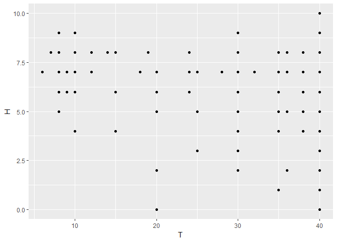
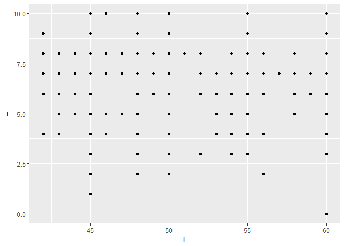
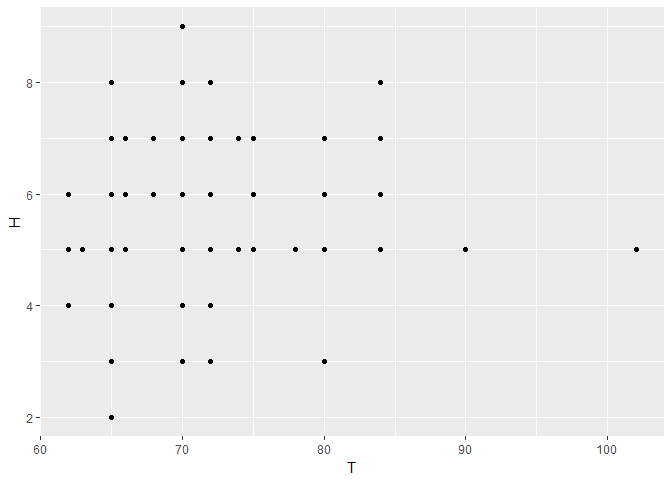

R 통계분석 개인 REPORT
================

1. 요약(초록): 전체 분석 절차와 결론
------------------------------------

### (1) 문제의식

우리나라에서 올 7월부터 최대 노동 시간이 52시간으로 제한된다. 사업장 인원수 별로 순차적으로 진행되는데, 합의만 있으면 거의 무제한으로 노동이 가능했던 게 끝나는 것이다.

이러한 정책이 시행되는 배경에는 네덜란드, 프랑스, 일본 등에서는 주 4일제를 실제로 시행하는 기업도 많다는, 국제적인 흐름도 있다.

그렇다면 ‘노동시간을 왜 줄이는 것일까?’ ‘노동시간이 준다면 인간이 행복해질까?’ ‘워라밸은 실제로 인간의 행복감에 영향을 끼치는가?’ 하는 생각에서 분석을 시작하게 되었다.

### (2) 분석절차

먼저, 분석하게 된 데이터는 2015년 ‘서울 복지 실태조사’ 데이터이다. 대부분 응답자는 경제활동을 하는 가구주이고 1인 가구 등 다양한 가구가 있어, 가구주(대부분의 응답자)를 분석해보았다. 노동시간 대비 행복도나 삶의 질을 측정할 수 있는 변수들은 몇 개가 있었으나, 숫자로 표현하기에 행복도 변수가 가장 적절하여 활용하게 되었다.

‘경제활동을 하고 있는 가구주 중 근로시간이 높을수록 행복지수가 낮을 것이다’라는 가설을 세우고 근로능력 정도(B1\_1), 경제활동상태(B1\_3), 주당 근로시간(B1\_6), 행복도(F3) 등의 변수를 활용하였다. 근로능력정도는 미성년자나 ‘근로능력이 없어 경제활동이 불가능’한 사람은 제외했고, 경제활동상태도 실업자나 비경제활동인구는 제외했다.

다음으로 각 변수의 이름을 바꾼 후 근로시간별로 그룹을 나누었다. 법정근로시간 이하인 ‘0~40시간’그룹 (= T1), 법정근로시간 초과~주 최대 근로시간인 ‘41시간~60시간’그룹 (= T2), 최대 근로 시간초과인 ‘61시간 이상’그룹 (= T3) 으로 나누어 각 그룹별 행복도를 분석했다.

### (3) 분석결과

전처리 과정이 완료된 후, 근로시간별 그룹의 행복도를 점그래프로 나타내보니 눈에 띄게 T1 그룹의 그래프가 행복도가 높은 쪽에 몰려있는 것을 확인할 수 있었고, T3 그룹 그래프는 행복 만족도가 낮은 쪽에 쏠려있는 것을 확인할 수 있었다.

놀랍게도 T2 그룹 그래프는 중간 정도의 행복도가 많았다. 따라서 노동시간에 따라 인간의 행복도가 달라진다는 가설은 채택되었다.

### (4) 추가 분석

분석 이후 대체적인 비율이 궁금해져, 근로시간 그룹 별 행복도 그룹을 만들어 비율분석을 해보기로 했다.

행복도는 0점부터 10점까지 있는데, 낮다고 할 수 있는 0점부터 3점까지 (= H1), 중간단계의 행복도라고 할 수 있는 4점부터 6점(= H2), 행복도가 높다고 할 수 있는 7점부터 10점(= H3)까지의 그룹으로 나누었다.

분석 결과 소수점 둘째까지 나타내었을 때 T1 그룹의 H1 비율은 3.28%, H2 비율은 21.47%, H3 비율은 75.25%였고, T2 그룹의 H1 비율은 2.85%, H2 비율은 45.45%, H3 비율은 51.7%였다. 마지막으로 T3 그룹의 H1 비율은 3.40%, H2 비율은 70.00%, H3 비율은 26.53%였다.

### (5) 결론

결론적으로 인간의 근로 시간과 행복도는 상당한 상관관계가 있다는 것이 드러났고, 노동시간을 줄이는 것은 인간의 행복도를 증진시키기 위한 바람직한 방향임이 증명되었다.

2. 분석 주제: 문제의식, 알아보고자 하는 것
------------------------------------------

전 세계적으로 노동(근로) 시간을 감축하는 추세이다. 우리나라는 또한 감축 정책을 시행하고 있으나 지난 2015년 자료에 의하면 OECD 국가 중 연간 근로시간이 2위다.

근로시간을 줄이고 그 결과로 일자리가 창출되는 등 근로시간 감축에는 여러 가지 요인이 따라오지만 요즘 ‘워라밸’이라는 단어가 유행하듯이 정말 근로 감축이 인간의 행복감에 영향을 미치는지 알아보고자 한다.

3. 데이터 선정
--------------

데이터 소개(출처, 다운로드 URL, 특성, 구성)

출처 및 다운로드 URL : 서울복지실태조사 <http://data.si.re.kr/sisurvey2015er17>

특성 : 1) 서울시민의 생활실태와 복지 욕구 변화 추적을 위한 데이터 구축 2) 서울시 복지 정책 수립 및 집행성과 모니터링을 위한 근거 자료 수집 3) 서울특별시 거주 인구 4) 컴퓨터를 활용한 가구 방문 면접조사(CAPI) 5) 로우(원천)데이터

4. 분석
-------

### (1) 분석 목적 및 방법

\*\*\* 분석 목적 : 근로시간과 행복도가 유의미한 상관관계를 나타내는지 알아보기 위한 분석이다.

\*\*\* 분석 방법 : 1) 변수명 바꾸기 2) 그룹 나누기 3) 그래프 만들기

### (2) 변수 검토 및 전처리

#### 자료 분석을 위해 패키지 업로드

``` r
library(readxl)
library(dplyr)
library(ggplot2)
```

#### 자료분석 데이터 불러오기

``` r
df_1 <- read_excel("sisuvey.xlsx")
```

#### 자료 분석을 위한 변수명 바꾸기

``` r
df_2 <- df_1
df_2 <- rename(df_2, WA = B1_1_1, S = B1_3_1, T = B1_6_1, H = F3)
```

#### 선정한 4가지 변수를 select 하여 데이터 처리 속도를 빠르게 한다.

``` r
df_3 <- df_2 %>% 
  select(WA, S, T, H)
```

#### '근로능력 정도' 변수 중 만 14세 이하와 근로능력이 없어 경제활동을 하지 못하는 인원 제외,

#### '경제활동 참여상태' 변수 중 실업자와 비경제활동인원 제외 후 데이터 생성

``` r
df_4 <- df_3 %>% 
  filter(WA %in% c(1, 2, 3), S %in% c(1, 2, 3, 4, 5, 6, 7))
```

#### 근로시간 변수 중 40시간 이하, 41~60시간, 61시간 이상으로 나누어 각각의 데이터 생성

``` r
T1 <- df_4 %>% 
  filter(T <= 40)
T2 <- df_4 %>% 
  filter(T > 40 & T <= 60)
T3 <- df_4 %>% 
  filter(T >= 61)
```

#### 그래프를 통해 H 변수(행복도)의 분포를 알아본다. T1 그룹의 경우

``` r
ggplot(data = T1, aes(x = T, y = H)) + geom_point()
```



#### 그래프를 통해 H 변수(행복도)의 분포를 알아본다. T2 그룹의 경우

``` r
ggplot(data = T2, aes(x = T, y = H)) + geom_point()
```



#### 그래프를 통해 H 변수(행복도)의 분포를 알아본다. T3 그룹의 경우

``` r
ggplot(data = T3, aes(x = T, y = H)) + geom_point()
```



#### 분석 결과 근로시간이 많을수록 행복도가 낮은 경향인 것을 발견할 수 있었음

### 추가분석(비율을 알아보기 위함)

#### T1의 행복도 0~3점 그룹인 H1\_1 그룹 데이터 생성

``` r
H1_1 <- T1 %>% 
  filter(H <= 3)
```

#### T1의 행복도 4~6점 그룹인 H1\_2 그룹 데이터 생성

``` r
H1_2 <- T1 %>% 
  filter(H >= 4 & H <= 6)
```

#### T1의 행복도 7~10점 그룹인 H1\_3 그룹 데이터 생성

``` r
H1_3 <- T1 %>% 
  filter(H >= 7)
```

#### T2의 행복도 0~3점 그룹인 H2\_1 그룹 데이터 생성

``` r
H2_1 <- T2 %>% 
  filter(H <= 3)
```

#### T2의 행복도 4~6점 그룹인 H2\_2 그룹 데이터 생성

``` r
H2_2 <- T2 %>% 
  filter(H >= 4 & H <= 6)
```

#### T2의 행복도 7~10점 그룹인 H2\_3 그룹 데이터 생성

``` r
H2_3 <- T2 %>% 
  filter(H >= 7)
```

#### T3의 행복도 0~3점 그룹인 H3\_1 그룹 데이터 생성

``` r
H3_1 <- T3 %>% 
  filter(H <= 3)
```

#### T3의 행복도 4~6점 그룹인 H3\_2 그룹 데이터 생성

``` r
H3_2 <- T3 %>% 
  filter(H >= 4 & H <= 6)
```

#### T3의 행복도 7~10점 그룹인 H3\_3 그룹 데이터 생성

``` r
H3_3 <- T3 %>% 
  filter(H >= 7)
```

#### 각 그룹별 행복도의 비율 알아보기

##### T1 그룹의 행복도 별 비율

``` r
26+170+596
```

    ## [1] 792

``` r
26/792*100
```

    ## [1] 3.282828

``` r
170/792*100
```

    ## [1] 21.46465

``` r
596/792*100
```

    ## [1] 75.25253

T1그룹의 행복도 별 비율은 소수점 두번째 자리까지 나타냈을 때 행복도 0~3점 : 3.28%
행복도 4~6점 : 21.47%
행복도 7~10점 : 75.25%으로 나타남.

##### T2 그룹의 행복도 별 비율

``` r
47+750+853
```

    ## [1] 1650

``` r
47/1650*100
```

    ## [1] 2.848485

``` r
750/1650*100
```

    ## [1] 45.45455

``` r
853/1650*100
```

    ## [1] 51.69697

T2그룹의 행복도 별 비율은 소수점 두번째 자리까지 나타냈을 때 행복도 0~3점 : 2.85%
행복도 4~6점 : 45.45%
행복도 7~10점 : 51.70%으로 나타남.

##### T3 그룹의 행복도 별 비율

``` r
5+103+39
```

    ## [1] 147

``` r
5/147*100
```

    ## [1] 3.401361

``` r
103/147*100
```

    ## [1] 70.06803

``` r
39/147*100
```

    ## [1] 26.53061

T3그룹의 행복도 별 비율은 소수점 두번째 자리까지 나타냈을 때 행복도 0~3점 : 3.40%
행복도 4~6점 : 70.00%
행복도 7~10점 : 26.53%으로 나타남.

### (3) 분석 및 해석

그래프에서도 알 수 있었고, 비율로써도 증명되었듯이, 예상대로 근로시간이 많을수록 행복도가 낮은 경향이 나타나는 것으로 보여 가설은 채택되었다.

5. 논의
-------

### 한계점 및 비판점

-   단순히 두 가지 변수로만 비교하여 다른 변수와의 관계성 분석 부족.
-   변수를 만든 것이 아니라 데이터 자체를 만들어 쓴 점.
-   가구원 모두를 조사하지 않았고, 가구주 위주로 분석한 점.

### 추후분석 방향

행복도가 증진됨에 따라 다른 변수도 유의미한 관계가 있는지 알아보는 방향으로 추후에 분석하면 될 것 같다. 예를 들면 행복도가 높아짐으로써 자원봉사 활동 의사가 높아진다든지 이러한 것들을 분석한다면, 근로시간을 줄이게 돼도 자원봉사 활동 시간이 많아질 가능성이 있다는 것을 알아낼 수 있을 것이다. 한 가지 분석에 그치는 것이 아니라 유의미한 분석 방향을 찾는다면 사회적으로도 의미 있는 분석이 되리라 생각한다.
